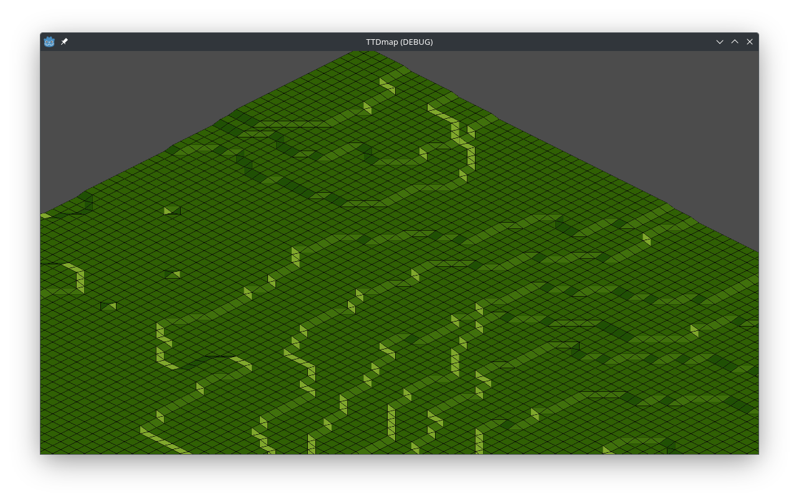

# Height Tile Map for Godot 4
__Work in progress!__

I am trying to replicate the [OpenTTD](https://newgrf-specs.tt-wiki.net/wiki/NML:List_of_tile_slopes) map system in Godot 4.

To get this working I need each height layer to be shifted some pixels up.
As the normal tile map cannot work with shifted layers, I am trying to build a new tile map, 
which leverages multiple normal tile maps, one for each layer.

I am not sure yet, if / how this tile map could be used in real projects. 
For now think of it as a tech-experiment.

A small, simple noise generator is included to generate example maps. It will regenerate on each run.  
It requires the map size to be 2^n
(Note: currently it is a bit broken and generates invalid tiles which cannot be rendered...)

